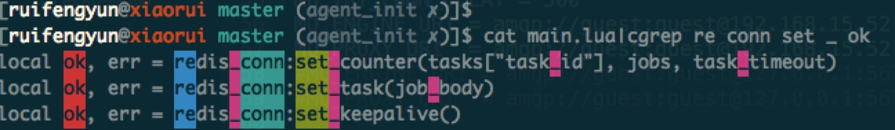

# cgrep

### Install

```
git clone git@github.com:rfyiamcool/cgrep.git
cd cgrep
sudo python setup.py install
```

### Usage:

example

```
cat cgrep.py |cgrep "(line|self)"
cat cgrep.py |cgrep "xiaorui\.cc"
cat cgrep.py |cgrep -a "line"
```

help

```
[ruifengyun@xiaorui ~ ]$ cgrep -h
Usage:/usr/local/bin/cgrep [-v|-i|-a|-h] args....
```

